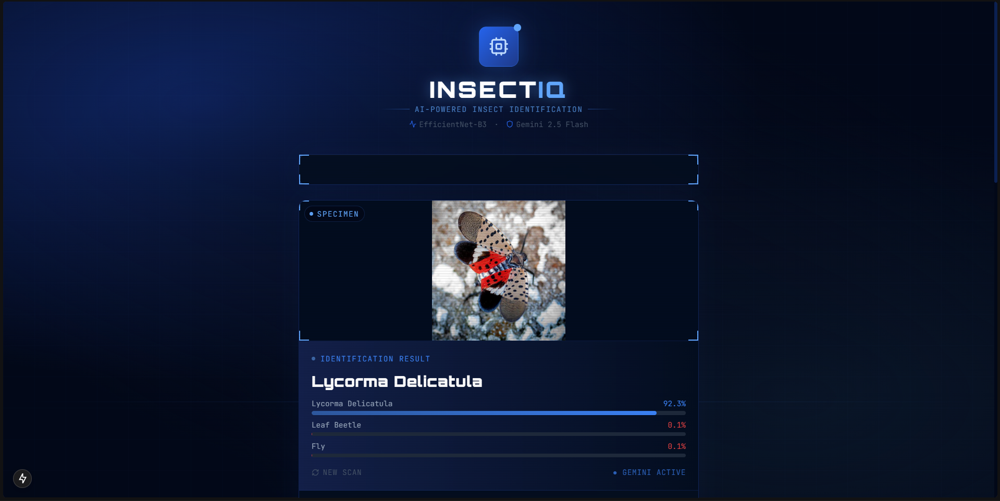
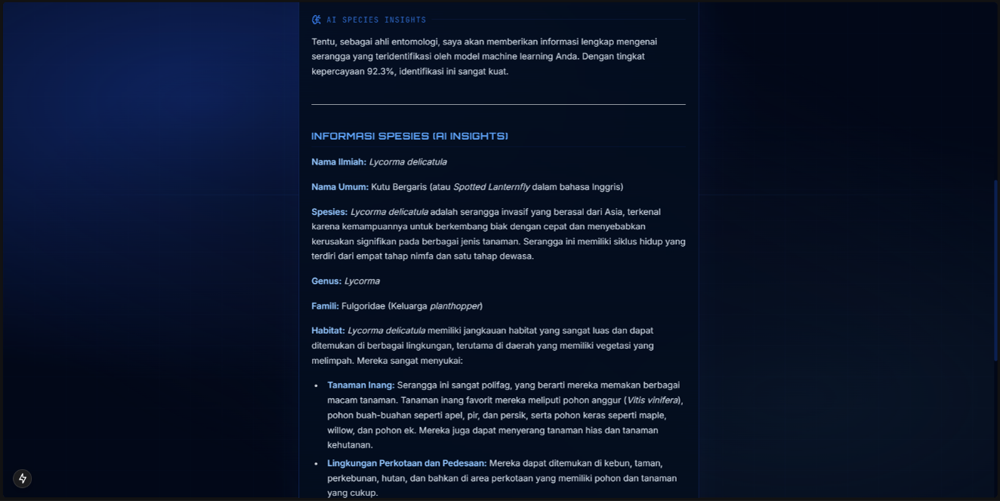
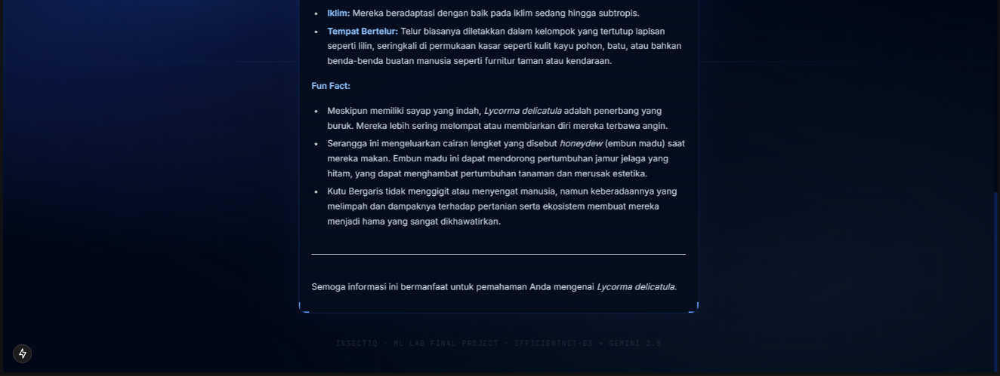

# 🔬 InsectIQ — Smart Insect Identifier & AI Insights

Final Project ML Lab — Identifikasi serangga otomatis berbasis **EfficientNet-B3** + **Gemini 2.5 Flash Lite**.

---

## Struktur Proyek

```
InsectIQ/
├── files/
│   └── notebook.ipynb          ← Training notebook (jalankan di Kaggle/Colab)
├── backend/
│   ├── artifacts/              ← Taruh model_scripted.pt & metadata.json di sini
│   ├── env.example             ← Template env (salin ke .env)
│   ├── gemini_service.py
│   ├── main.py
│   ├── ml_service.py
│   └── requirements.txt
├── frontend/
│   ├── app/
│   │   ├── page.tsx            ← Main UI
│   │   ├── layout.tsx
│   │   └── globals.css
│   ├── components/
│   │   └── ResultCard.tsx
│   ├── package.json
│   ├── tailwind.config.ts
│   └── tsconfig.json
└── .gitignore
```

---

## Langkah Menjalankan

### 1. Training Model (Kaggle / Google Colab)

1. Upload `files/notebook.ipynb` ke Kaggle
2. Sambungkan dataset insect dari Kaggle Datasets
3. Aktifkan GPU (Settings → Accelerator → GPU T4 x2)
4. Jalankan semua sel
5. Download hasil dari `/kaggle/working/artifacts/`:
   - `model_scripted.pt`
   - `metadata.json`

### 2. Backend (FastAPI)

```bash
cd backend

# Salin environment
cp env.example .env
# Edit .env → isi GEMINI_API_KEY dari https://aistudio.google.com

# Taruh model artifacts
# backend/artifacts/model_scripted.pt
# backend/artifacts/metadata.json

# Buat virtual environment
python -m venv env

# Aktivasi (Linux/macOS)
source env/bin/activate
# Aktivasi (Windows)
env\Scripts\activate

# Install dependencies
pip install -r requirements.txt

# Jalankan server
uvicorn main:app --reload
```

API berjalan di `http://localhost:8000`
Dokumentasi API: `http://localhost:8000/docs`

### 3. Frontend (Next.js)

```bash
cd frontend

npm install
npm run dev
```

Akses di `http://localhost:3000`

---

## Tech Stack

| Layer    | Teknologi                          |
|----------|------------------------------------|
| Model    | PyTorch · EfficientNet-B3 (timm)   |
| Backend  | FastAPI · Python 3.11+             |
| AI/LLM   | Gemini 2.5 Flash Lite              |
| Frontend | Next.js 15 · Tailwind CSS · Framer Motion |

---

## Catatan Penting

- Pastikan file `.env` **tidak** di-commit ke GitHub (sudah ada di `.gitignore`)
- Folder `env/` dan `node_modules/` juga sudah di-ignore
- Jika Gemini error 503, backend tetap mengembalikan hasil prediksi model

---

## Project Preview




